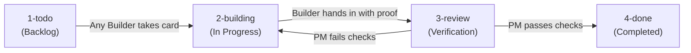

# How We Build: The Multi-Agent Card Factory

This repository is built using an asynchronous, multi-agent development factory where multiple AI coding agents collaborate with a human project owner and a dedicated AI project manager (PM) agent.

Instead of unconstrained agent execution, all work follows a disciplined card-based pipeline governed by strict file boundaries, re-runnable proof, and written quality standards.

---

## 1. The Pipeline

The development pipeline runs across four physical folders. **The directory a card sits in is its active status.**

| Stage | Owner / Role | What Happens |
|---|---|---|
| **`1-todo`** | PM Agent | The PM agent (with the owner) authors cards specifying goals, scope, and acceptance criteria. |
| **`2-building`** | Any AI Builder | A builder takes a card, records claim details, moves the card to `2-building`, and modifies only the approved files. |
| **`3-review`** | PM Agent | The builder documents exact changes and re-runnable proof, then hands the card in. The PM agent independently re-runs the checks. |
| **`4-done`** | PM Agent | If all criteria pass, the PM agent moves the card to `4-done`. Any superseded files listed under `Replaces` are archived into an organized archive folder. |

Every card transition is recorded with a single timestamped line in a central line log.

---

## 2. The Task Card

Every task is defined in a single markdown card. Work cannot begin without an active card.

A card contains:
* **Metadata:** Assigned builder, claim timestamp, relevant Done Standard, and whether owner approval is required.
* **Goal & Task:** A clear, non-technical explanation of the business need and specific delivery requirements.
* **Scope & Boundaries:** An explicit list of allowed files. Builders must touch **only** the files listed on the card; touching unlisted files triggers an automated pipeline flag.
* **Done Looks Like:** An unambiguous checklist of verifiable conditions.
* **Replaces:** Any files made obsolete by the work.
* **Build Handoff & Proof:** Where the builder documents the solution and attaches re-runnable verification commands, logs, or outputs.

---

## 3. Roles and Responsibilities

* **The Project Owner (Human):** Sets project priorities, sets boundaries, and holds sole authority over external actions.
* **The PM Agent (AI):** The sole writer of task cards and the single authority permitted to evaluate review submissions and pass cards to `4-done`.
* **The Builders (Any AI Agent):** Multiple independent AI models (e.g. Gemini, Claude, Codex) can claim available cards from `1-todo`, work within the same repository—with the card's explicit file list establishing the task boundary—and submit them for review.

---

## 4. Quality Standards & "Trust the Proof"

Claims like "complete", "100%", or "verified" are prohibited unless accompanied by verifiable proof. Work is judged against specific written standards:

* **Website:** Pages must load without console errors, render responsively without horizontal overflow, match canonical facts, and contain no dead links.
* **Bot & Telephony Replies:** Every factual claim must be traceable to a specific source line. If knowledge is missing, the assistant must state its boundary rather than guessing.
* **Data Masters:** Must maintain accurate schemas, validate cleanly in consumer runtimes, and distinguish synthetic test data from real business facts.
* **Research:** All market and pricing claims must cite primary provider URLs with retrieval dates.
* **Three-Strike Rule:** If a card fails PM review three times, work immediately halts for human owner escalation.

---

## 5. Automated Pipeline Safety

To prevent accidental regressions, drift, or scope creep, automated factory utilities are run on-demand to check pipeline integrity:

* **Board Integrity (`check-in.mjs`):** Checks the board state and flags cards stalled in development, cards handed in without proof, or unauthorized file changes outside active card scope.
* **Safe Archiving (`archive.mjs`):** When a card passes review, the archiver script (`archive.mjs`) is run to move superseded files listed under `Replaces` into an organized historical archive with a logged manifest. Nothing is deleted.
* **Strict Human Gates:** AI agents are strictly barred from autonomous spending, paid API calls, remote git pushes, external deployments, or external business outreach. Each action requires the owner's explicit yes.

---

## 6. Worked Example: Task Card T01

To illustrate the pipeline in practice, consider task **T01 (Workspace Organization)**:

1. **Card Created in `1-todo`:** The PM agent specified a target directory layout to separate master application code, data generators, research, and public distribution copies.
2. **Claimed to `2-building`:** A builder claimed the card, updated the log, verified script dependency paths, and staged file moves.
3. **Handed in to `3-review`:** The builder documented the exact paths moved, verified that file sizes remained non-zero, tested that generator scripts still ran cleanly, and logged the handoff.
4. **PM Verification & `4-done`:** The PM agent independently verified that directory structures and scripts remained intact. When the check-in script flagged 8 file modifications, the PM re-verified each against the card's explicit file list, confirmed all 8 were authorized, logged the false alarm as a check-in script bug, and awarded a **PASS Round 1**, moving the card to `4-done`.
