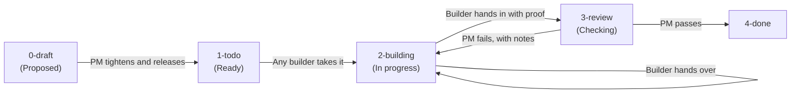

# How We Build: The Multi-Agent Card Factory

This project is built by several AI models (Claude, Gemini, Codex) working on the same repository with one human owner. Nobody works freely on the real product. Every change to it goes through a **task card**, is built against an explicit file list, and only counts as done when an AI project manager (PM) has re-checked the proof against a written **Done Standard**.

The factory has run since 2026-10-01. This page describes it as it works today (2026-10-07).

---

## 1. Two Places to Work

| Where | What goes there | Card needed? |
|---|---|---|
| **A model's own Ideas folder** (one per AI) | Brainstorms, research, drafts, prototypes, that model's own handoff note | No. Work freely with the owner |
| **The masters** (website app, data files, phone/chat bot code, showcase, scripts) | The real product | Yes. Only the files the card lists |

Ideas folders are private working space and never public. Code only ever reads masters. When an idea is ready, its author writes a **proposal card**.

---

## 2. The Board

The board is five folders. **The folder a card sits in is its status.**

| Step | Who | What happens |
|---|---|---|
| **Propose** (`0-draft`) | Any AI, or the owner | Copies the card template, fills in goal and task, points to the Ideas work behind it |
| **Release** (`0-draft → 1-todo`) | PM only | Tightens the card (facts with sources, file list, "Done looks like", Done Standard), gives it a T number. A reviewer agent may comment on the draft first |
| **Take** (`1-todo → 2-building`) | Any AI builder | Writes its name and claim time on the card |
| **Hand over** (stays in `2-building`) | The builder, if it can't finish | Writes "Where I got to" and sets `Builder: open (was <name>)`. Any AI can pick it up |
| **Hand in** (`2-building → 3-review`) | The builder | Writes what changed (exact paths), re-runnable proof, and which "Done looks like" lines it thinks are met |
| **Check** (`3-review → 4-done` or back) | An independent reviewer first, then the PM decides | Re-runs the checks. PASS moves to `4-done`; FAIL goes back with the exact line that failed |

Every move is one timestamped line in a shared `log.md`. After **three FAILs** a card stops and goes to the owner with the PM's recommendation.

**Quick lane:** a fix of roughly 15 minutes or less that the owner explicitly says "just do it" to needs no card. It gets one log line instead.

---

## 3. The Task Card

One task = one markdown file. A card holds:

* **Header:** builder, claim time, which Done Standard applies, and any owner approval it needs (spend, push, deploy, contact, delete).
* **Goal & Task:** why the card exists, and what to do, with the facts the builder needs copied in alongside their sources.
* **Implementation:** a suggested approach (the builder may change it and say why).
* **Done looks like:** a checklist the PM can open, run or ask.
* **Files:** every file or folder the card may touch. Touching anything else is flagged.
* **Replaces:** files this work makes out of date (archived after the PASS, never deleted).
* **Working notes, Build handoff, Proof, PM's checks:** the back-and-forth stays on the card, not in new files.

---

## 4. Roles

* **Project owner (human):** sets priorities and makes every outward-facing decision. Spending, paid API calls, deploys, GitHub pushes, posts, deleting files and contacting businesses each need the owner's yes for that specific action. One yes doesn't cover the next action.
* **PM agent (Claude):** the only one who releases cards, passes or fails them, and edits the live status page, decisions log and Done Standards. Never builds.
* **Reviewer agents:** a second pair of eyes that advises only; when the PM and a reviewer disagree, the owner decides. The Codex reviewer did this from 2026-10-02 and has been paused since 2026-10-05. **Katy** (on trial since 2026-10-05) is a Claude agent that re-checks a card herself, then has Jev, a model from a different family, judge each "Done looks like" line against the evidence she produced, never the builder's claims. Her advice counted only after she passed a decoy card with three planted faults. Each of her reviews has a $0.10 cap on Jev calls.
* **Builders (any AI):** Claude, Gemini or Codex take cards from `1-todo`, one at a time. The PM picks the builder, the model and its effort setting for each card, and writes a one-line reason on the card. If that model isn't available, the builder says so on the card and uses the next suitable one.
* **Helper agent (small Claude model):** runs check-in scans, carries out the archive moves the PM lists, and writes each Ideas folder a note on what in it is no longer true. Never moves cards or decides.

**Who checks whose work (from 2026-10-06).** Every card gets a check by someone other than its builder before the PM's decision:

| Built by | Checked by |
|---|---|
| Codex | the PM agent (Claude) |
| Gemini | the PM agent (Claude) |
| Claude | Katy (Claude, with Jev as judge), then the PM |

A Claude-built card is never passed by Claude alone: Jev's judgement is the non-Claude check, and if the PM is still in doubt it asks the owner for a Gemini or Codex look. The owner can also ask Katy to look at any card. Only the PM passes or fails a card.

**Model calls and spending.** Every paid model call goes through a local key proxy that adds the key, so no agent handles a raw key. The owner set a $2 cap for all model calls in the project; inside it, builders don't need a fresh yes per call, and each paid call is logged with the running total. Spent so far: about $0.96.

---

## 5. Done Standards ("Trust the Proof")

"Done", "tested", "verified" or "works" on their own are not proof. Proof is something the PM can open or re-run, such as command output, screenshots, or "asked X, bot said Y, source Z". Each card names one written standard:

| Standard | In short |
|---|---|
| **Website** | Loads without console errors, no horizontal overflow on mobile, facts match the data master, no dead links |
| **Bot replies** | Every factual claim traces to a source line; missing knowledge gets an honest "I don't know" and a handoff to staff, never a guess |
| **Phone bot** | The same grounding rules as the chat bot, checked by voice; nobody may call the phone service live until a number-connection card passes |
| **Data file** | Valid schema, loads in the code that reads it, synthetic test data clearly separate from real business facts |
| **Research** | Market and pricing claims cite primary sources with retrieval dates; assumptions are labelled as assumptions |
| **Docs and records** | Paths exist, claims match the files, plain English |
| **Repo and publishing** | Allow-list `.gitignore`, staged paths listed and checked, no personal data, keys or real-business identities, owner's yes per push |
| **Real-business demo** | A real business's details stay out of anything public; demos live in private folders |

---

## 6. Factory Tooling

Two small Node scripts keep the board honest. Neither one builds anything.

* **`check-in.mjs` (run on demand, read-only):** prints the board and flags problems. These include cards in building for more than 2 days, cards handed in with no proof, cards in done without a PM PASS, cards on 3+ FAILs not escalated, a card whose folder doesn't match the log, moves made by someone not allowed to make them, two open cards holding the same file, and **recently changed files that no card lists** (work done outside a card). Card T07 (in review, round 3) adds a `move-card` script, shows drafts, and says who each card waits on.
* **`archive.mjs` (run after a PASS):** run with `--dry-run` first, then for real. It moves the card's "Replaces" files into `archive/` and appends a row per move to `archive/MOVES.md`. The PM then checks those rows. Nothing is deleted.

Neither script runs on a schedule. Hand-offs between AIs are still manual: the owner opens the next AI when check-in shows a card waiting on it.

---

## 7. Jev: Picking Models, Then Checking Replies (T13, T23)

Card T13 tried letting a decision model choose. For each card it scored 54 options (each model in the owner's three AI subscriptions, at each effort setting) against the card's text and recommended one. Three routing calls, one each for T07, T11 and T14, cost **$0.000678** in total. Its pick matched the PM's hand pick on **2 of 3** cards (T07 and T11; for T14 it picked Claude, the PM had picked Gemini).

What changed on 2026-10-03: the PM now picks the builder, model and effort for every card, and the decision model's pick is advisory only. No card waits for it. The takeaway so far is that choosing the model was slowing the line down, while the independent review rounds are what caught real problems. T13 is on hold and isn't done.

Jev went back to its first job instead: checking bot replies. Card **T23** (passed 2026-10-07, round 4) built the **Jev reply check**, a reusable part every bot build now gets. It gives Jev the business facts, the visitor's question and the bot's draft reply, and the reply is blocked when Jev's confidence that the facts back it is below a bar (0.67). Tuned on recorded replies from the private real-business demo, it caught 11 of 11 wrong replies in the tuning batches and 2 of 2 in the report batches, and wrongly blocked 4 of 27 and 7 of 48 right replies. The PM's own test: 3 of 3 wrong blocked, 0 of 2 right blocked. Median 186 ms a call. The report batches held only 2 wrong replies, so those numbers are small.

---

## 8. Where the Board Stands (2026-10-07)

| Card | Title | Builder | Status |
|---|---|---|---|
| T01 | Tidy the project folder: one master per thing | Claude | done |
| T02 | Archive automatically when a card passes | Claude | done |
| T03 | Alpine Wave services data file | Gemini | done |
| T04 | Everything in the Mountains data (Excel master + JSON export) | Gemini | done |
| T05 | Stack check: voice, phone numbers, hosting, reply writer | Gemini | done (hosting question moved to T20) |
| T06 | Update both GitHub repos | Claude (was Gemini) | done |
| T08 | Brief for the reviewer agent | Codex | done |
| T10 | Test questions for the Alpine Wave bots (27 cases, each tagged with the bot it applies to) | Claude | done, PASS on round 3 |
| T11 | Website chat answers from the data file | Codex (rounds 1-5, 7), Gemini (6), Claude (8-9) | done, PASS after 9 rounds, on the model path |
| T12 | Phone bot: a browser-tested voice prototype (not connected to a phone number) | Gemini | done, PASS on round 3 |
| T14 | Phone bot limits in the services data file | Gemini | done, PASS on round 2 |
| T15 | Facts file for a real local business, from its public website, kept private | Claude | done, PASS on round 2 |
| T16 | Website chat status text | Codex | done |
| T17 | "When the bot isn't sure" fact in the services data | Codex | done |
| T18 | "What a client's bot does for that client" facts in the services data | Codex | done |
| T20 | Hosting: which host, what it costs, how the model key gets there | Claude | done, PASS on round 2 |
| T23 | Jev reply check: a reusable part every bot build gets | Claude | done, PASS on round 4 |
| T07 | `move-card` script; check-in shows drafts and who each card waits on | Gemini | in review, round 3 (failed rounds 1 and 2) |
| T13 | Recommend the best model for each card | Claude | in review, on hold |
| T19 | Real-business website chat demo, kept private | Claude | building (failed round 1; restarts with the Jev reply check) |
| T22 | Simple, safe backup for the website chat | Codex | building (failed round 1) |
| T21 | Publish the build code to the public repo | not taken yet | to do |
| T24 | Retell chat widget vs our own chat, on Retell's free credit | not taken yet | to do |
| T25 | Review the Katy + Jev trial: what works, what to change | not taken yet | to do |
| T09 | Rules update for the reviewer role | not picked yet | draft |
| (unnumbered) | Phone text-back idea; reviewer corrections | — | drafts (proposals) |

---

## 9. Worked Example: Task Card T01

1. **Card in `1-todo`:** the PM specified a target layout that separates master application code, data generators, research and the public copy.
2. **Taken to `2-building`:** a builder claimed the card, logged it, checked script dependency paths and staged the file moves.
3. **Handed in to `3-review`:** the builder listed the exact paths moved, showed file sizes were still non-zero, re-ran the generator scripts and logged the hand-in.
4. **PM check and `4-done`:** the PM independently checked that the directory structure and scripts still worked. Check-in flagged 8 file modifications. The PM re-checked each one against the card's file list, confirmed all 8 were allowed, logged the false alarm as a check-in bug and gave a **PASS on round 1**.

A less tidy example: **T10** (bot test questions) failed round 2. The reviewer spotted that five cases cited chat-only limits for both bots. The builder added an `applies_to` tag to every case (21 apply to both bots, 6 to the website only), and the card passed on round 3.

A disagreement example: **T14** (phone limits in the data file) failed round 1 because the new limits clashed with what the phone product offers to clients; the builder scoped them to Alpine Wave's own line. On round 2 the PM's checks were clean but the reviewer couldn't confirm that only the card's files had changed. PM and reviewer disagreed, so the owner decided, and the card passed.
